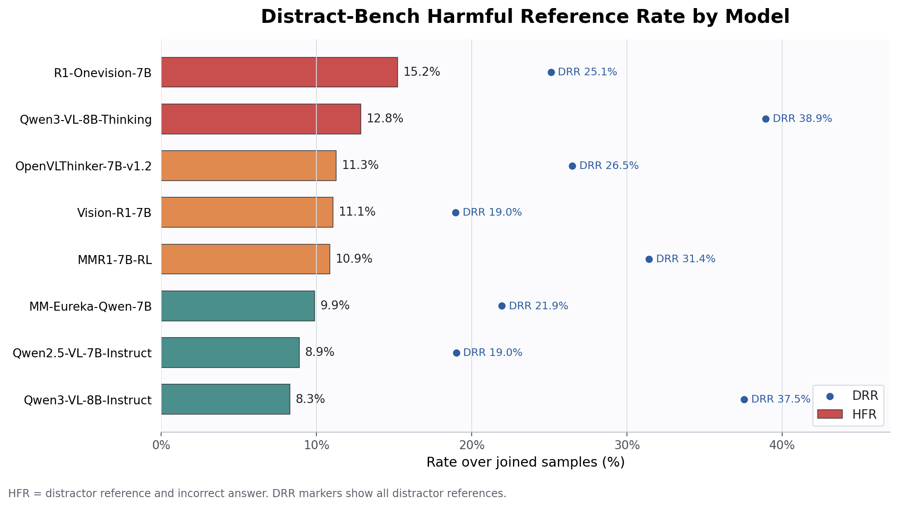

# Distract-Bench

Distract-Bench is a benchmark for evaluating robustness to
answer-preserving semantic distractions in multimodal reasoning.

This code repository releases the corrupt-side model outputs on Distract-Bench
and the code for calculating the proposed DRR and HFR metrics. It also includes
the script used to call an LLM judge for distractor-reference judgments and the
benchmark JSONL metadata, while the actual images are intentionally excluded
from this GitHub release.

## Repository Contents

```text
Distract-Bench/
  data/
    questions.jsonl
    edit_instructions.jsonl
  scripts/
    compute_drr_hfr.py
    judge_distractor_reference.py
  examples/
    reference_judgments.jsonl
    correctness_judgments.jsonl
    combined_judgments.jsonl
  model_outputs/
    corrupt_results/
    corruption_reference/
```

## Dataset Metadata

`data/questions.jsonl` contains one JSON object per benchmark sample. Common
fields include:

- `final_id`: numeric benchmark sample id as a string.
- `image`: relative path to the distracted image in the companion image release.
- `question`: benchmark question text.
- `options`: answer options when available.
- `answer`: gold answer.

`data/edit_instructions.jsonl` is keyed by the same `final_id` and contains the
semantic distraction specification:

- `edit.dead_end_description`: concise description of the injected distractor.
- `edit.trap_reasoning_path`: reasoning path the distractor is designed to
  induce.
- `edit.trap_answer`: intended trap answer.
- `edit.edit_instruction`: image-editing instruction used to create the
  distracted image.
- `edit.style_constraints`: visual styling constraints for the edit.

## Metrics

DRR and HFR are computed over samples that have both an answer-correctness
judgment and a distractor-reference judgment.

```text
DRR = # referenced distractor / # joined samples
HFR = # referenced distractor and answered incorrectly / # joined samples
RRR = # referenced distractor and answered correctly / # referenced distractor
```

DRR measures whether the model explicitly refers to, quotes, attends to, or uses
the injected semantic distractor. HFR measures harmful reference: the model
references the distractor and gives an incorrect answer.

In words, DRR asks: "How often does the model notice or use the distractor at
all?" A high DRR means the distractor appears in the model's reasoning or final
answer more often. HFR asks a stricter question: "How often does the model both
use the distractor and fail the task?" HFR is therefore the more direct measure
of harmful distractor uptake; a model can have high DRR but lower HFR if it
recognizes the distractor and still recovers the correct answer.

## Results Snapshot

The included corrupt-side model outputs cover 8 models and 4,047 joined
Distract-Bench correctness/reference judgments. Across those joined samples,
1,110 outputs reference the distractor and 447 both reference the distractor and
answer incorrectly.

| Model | n | Distract-Bench acc | Ref / DRR | Ref+correct / RRR | Ref+wrong / HFR | P(wrong\|ref) | P(correct\|no-ref) | P(ref\|wrong) |
|---|---:|---:|---:|---:|---:|---:|---:|---:|
| Fancy-MLLM__R1-Onevision-7B | 506 | 61.3% | 127 / 25.1% | 50 / 39.4% | 77 / 15.2% | 60.6% | 68.6% | 39.3% |
| Qwen__Qwen3-VL-8B-Thinking | 506 | 81.0% | 197 / 38.9% | 132 / 67.0% | 65 / 12.8% | 33.0% | 90.0% | 67.7% |
| ydeng9__OpenVLThinker-7B-v1.2 | 506 | 69.4% | 134 / 26.5% | 77 / 57.5% | 57 / 11.3% | 42.5% | 73.7% | 36.8% |
| Osilly__Vision-R1-7B | 506 | 66.0% | 96 / 19.0% | 40 / 41.7% | 56 / 11.1% | 58.3% | 71.7% | 32.6% |
| MMR1__MMR1-7B-RL | 506 | 75.3% | 159 / 31.4% | 104 / 65.4% | 55 / 10.9% | 34.6% | 79.8% | 44.0% |
| FanqingM__MM-Eureka-Qwen-7B | 506 | 71.9% | 111 / 21.9% | 61 / 55.0% | 50 / 9.9% | 45.0% | 76.7% | 35.2% |
| Qwen__Qwen2.5-VL-7B-Instruct | 505 | 73.7% | 96 / 19.0% | 51 / 53.1% | 45 / 8.9% | 46.9% | 78.5% | 33.8% |
| Qwen__Qwen3-VL-8B-Instruct | 506 | 83.6% | 190 / 37.5% | 148 / 77.9% | 42 / 8.3% | 22.1% | 87.0% | 50.6% |

HFR by model, with DRR shown as reference markers:



## LLM Distractor-Reference Judge

`scripts/judge_distractor_reference.py` calls the OpenAI Responses API to
regenerate the `verdict: "yes"` / `verdict: "no"` distractor-reference
judgments included under `model_outputs/corruption_reference/`. This judge only
decides whether a model output explicitly references, mentions, attends to, or
uses the injected semantic distractor. It does not judge answer correctness.

The judge uses `data/questions.jsonl`, `data/edit_instructions.jsonl`, and
`model_outputs/corrupt_results/`; it does not require the image files. The
default judge model is `gpt-5-nano`, and it can be changed with
`--judge-model`.

Install the judge dependencies and set an API key:

```bash
python -m pip install openai tqdm python-dotenv
export OPENAI_API_KEY=...
```

Inspect planned judge calls without sending API requests:

```bash
python scripts/judge_distractor_reference.py --dry-run --limit 2
```

Generate reference judgments to a local output directory:

```bash
python scripts/judge_distractor_reference.py \
  --workers 4 \
  --out-root outputs/corruption_reference
```


## Compute DRR/HFR

The metric script has no third-party dependencies. The examples below use the
tiny files in `examples/` only to demonstrate the expected judgment formats.

Separate reference and correctness judgment files:

```bash
python scripts/compute_drr_hfr.py \
  --reference examples/reference_judgments.jsonl \
  --correctness examples/correctness_judgments.jsonl \
  --output-dir outputs/demo_separate
```

Combined judgment file:

```bash
python scripts/compute_drr_hfr.py \
  --combined examples/combined_judgments.jsonl \
  --output-dir outputs/demo_combined
```

The script writes:

- `per_model_metrics.csv`
- `summary.json`

For separate files, reference judgments should contain `verdict: "yes"` or
`"no"`, while correctness judgments should contain `verdict: "correct"` or
`"incorrect"`. Rows are joined by `final_id`, `doc_id`, `id`, `question_id`, or
`sample_id` by default. Use `--join-key FIELD` to force a specific key.

## Model Outputs

Corrupt-side model outputs are included under `model_outputs/corrupt_results/`.
Each file has 506 rows sorted by the public numeric `final_id` values `1`
through `506`.

Distractor-reference judgments are included under
`model_outputs/corruption_reference/` with the same public numeric sample ids.
